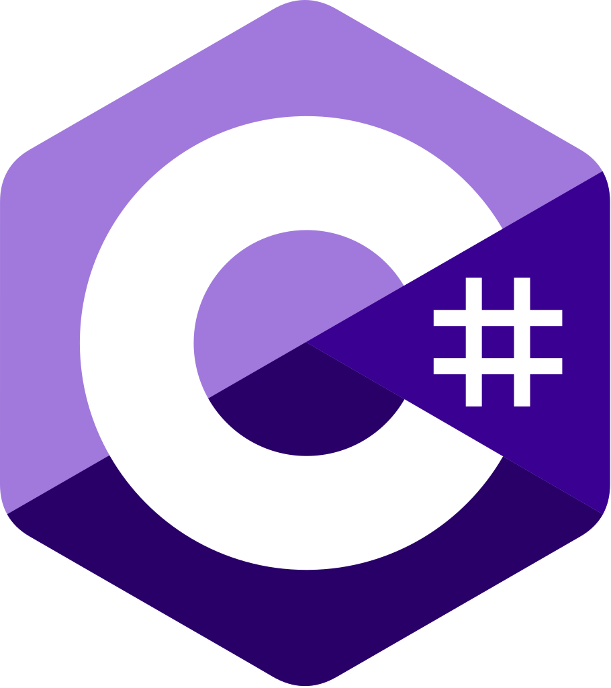

<p align="center">
  
  &nbsp;&nbsp;
  
</p>

# 🔷 Cours C# — ISI

> **Formateur :** Robert | **Établissement :** ISI (Institut Supérieur d'Informatique)
> **Niveau :** Licence 3

Ce dépôt couvre le langage C# depuis les bases jusqu'à la Programmation Orientée Objet et la connexion aux bases de données.

---

## 📚 Plan du cours

| # | Chapitre | Lien |
|---|----------|------|
| 1 | Introduction à C# | [cours/intro_Csharp.md](cours/intro_Csharp.md) |
| 2 | Bases du langage | [cours/baseCsharp.md](cours/baseCsharp.md) |
| 3 | Structures de données | [cours/structures_donneCsharp.md](cours/structures_donneCsharp.md) |
| 4 | Fonctions & Gestion d'erreurs | [cours/fonction_gesErr.md](cours/fonction_gesErr.md) |
| 5 | Programmation Orientée Objet | [cours/Concept-POO_Csharp.md](cours/Concept-POO_Csharp.md) |
| 6 | Bases de données avec C# | [cours/basededonné_csharp.md](cours/basededonné_csharp.md) |

---

## 🏋️ Exercices

Les exercices pratiques seront ajoutés progressivement dans [`exercices/`](exercices/).

---

## ✅ Corrections

Les corrigés sont dans [`corrections/`](corrections/).

---

## 🗂️ Organisation du dépôt

```
CoursCsharp/
├── cours/          → Chapitres du cours (.md)
├── exercices/      → TPs et exercices
└── corrections/    → Corrigés
```

---

## 🔗 Autres cours

| Cours | Lien |
|-------|------|
| Langage C | [Cours_LangageC](https://github.com/Robsroberto/Cours_LangageC) |
| Java | [CoursJava](https://github.com/Robsroberto/CoursJava) |
| Algorithmique | [CoursAlgo](https://github.com/Robsroberto/CoursAlgo) |
